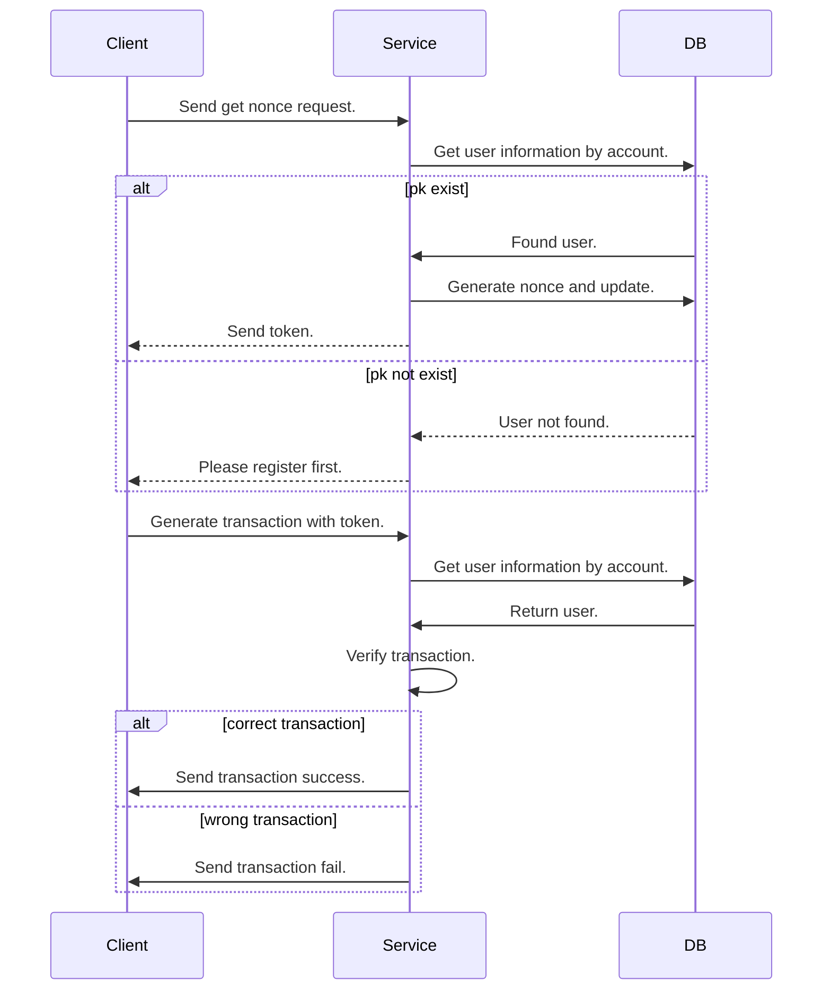

# Simple Bank System

## How to Run
1. generate image: `make gen-images`
2. run service: `make run-service`
3. You can access the API from `http://localhost:8080`

## Nonce
- Every JWT token will contain a nonce to prevent duplicate write operations. Once the token is used in a write operation, the token only has read permissions.

## API

| #   | action            | method | header | url                  | done               |
| --- | ----------------- | ------ | ------ | -------------------- | ------------------ |
| 1   | create an account | POST   | none   | `/account/register`  | :white_check_mark: |
| 2   | get token         | POST   | none   | `/account/nonce`     | :white_check_mark: |
| 3   | get balance       | GET    | jwt    | `/bank/balance`      | :white_check_mark: |
| 4   | get transactions  | GET    | jwt    | `/bank/transactions` | :white_check_mark: |
| 5   | create transfer   | POST   | jwt    | `/bank/transfer`     | :white_check_mark: |

### POST Body
| #   | action            | body                                               |
| --- | ----------------- | -------------------------------------------------- |
| 1   | create an account | name: string, password: string, balance: int       |
| 2   | get token         | account: string, password: string                  |
| 5   | create transfer   | action: int, from: string, to: string, amount: int |

### Transaction Action
| #   | action   |
| --- | -------- |
| 1   | Deposit  |
| 2   | Withdraw |
| 3   | Transfer |

### Response
| #   | action            | response                                                                   |
| --- | ----------------- | -------------------------------------------------------------------------- |
| 1   | create an account | name: string, account: string, balance: int                                |
| 2   | get token         | data: string (token)                                                       |
| 3   | get balance       | data: int (balance)                                                        |
| 4   | get transactions  | data: list -> {id: uint64, from: string, to: string,amount:int, state:int} |
| 5   | create transfer   | action: int, from: string, to: string, amount: int                         |

## Flow

## Improvements
1. The passwords need to be stored in encrypted form.
2. The action of obtaining transaction records requires paging. 
3. Use a database to persist data.